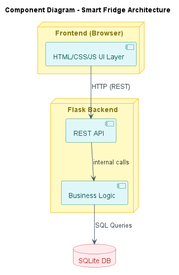
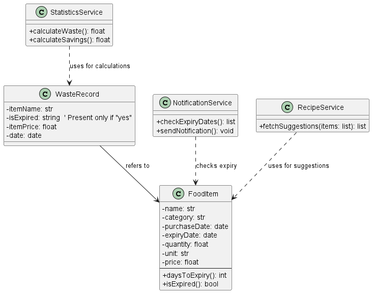
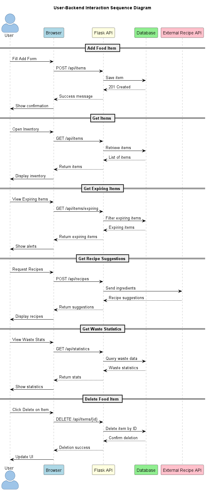
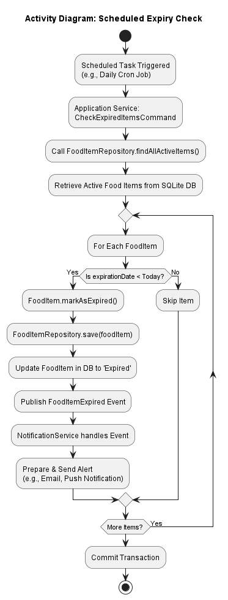
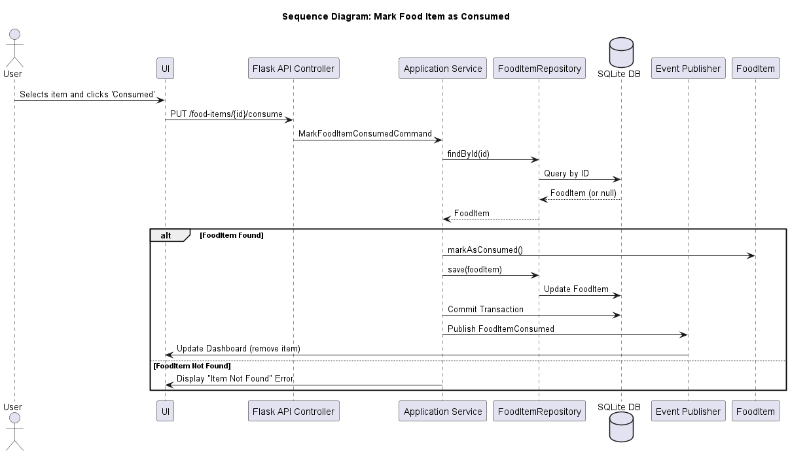

# Design

This chapter explains the strategies used to meet the requirements identified in the analysis.

The design focuses on clear separation of concerns while reflecting the current technological choices (Streamlit frontend + integrated backend).

# Architectural Style

## 3-Tier Architecture (Layered Architecture)

### Why this style?

- Clearly separates concerns: UI, business logic, and data persistence
- Promotes maintainability and scalability
- Easy to test and debug due to clear boundaries

# Actual Architecture

The system uses a **3-tier architecture**:

---

## 1. Presentation Layer (Frontend)
- **Technologies**: Streamlit (Python-based UI components) .
- **Responsibility**: Provides UI for user interactions directly within Streamlit.
- Includes dashboard, food item display, filtering, and statistics.
---

## 2. Application Layer (Backend)
- **Technology:** Python integrated with Streamlit
- **Responsibility**: Handles business logic such as:
  - Tracking food
  - Filtering
  - Waste statistics calculation
  - Recipe suggestions via Spoonacular API

---

## 3. Data Layer (Persistence)
- **Database**: SQLite local file
- **Responsibility**: Local storage of:
  - Food items
  - Expiration dates
  - User statistics

---

# Infrastructure

This is a non-distributed system in its initial version.

- **Clients**: Streamlit app accessed on desktop, tablet, or mobile.
- **Server**: Integrated in Streamlit (local or deployed container).
- **Database**: SQLite file on the same machine as the Streamlit app.
- **External API**: Spoonacular (via HTTPS, for recipe suggestions)

---

## Deployment Considerations

- All components co-located in a single app instance.
- Streamlit handles serving the application without a separate web server.
- Offline mode supported via local SQLite database.

---

# Modelling

## Domain-Driven Design (DDD)

### Bounded Contexts

- Inventory Management    
- Waste Statistics  
- Recipe Suggestion Engine

### Domain Concepts

| Context             | Entity / Aggregate       | Description                                      |
|---------------------|--------------------------|--------------------------------------------------|
| Inventory           | `FoodItem`               | Represents a stored food item with all metadata |
| Waste Statistics    | `WasteRecord`            | Tracks expired vs consumed items                |
| Recipe Suggestion   | `RecipeQuery / Recipe`   | Models interaction with external AI API         |

### Repositories / Services

- `FoodItemRepository`: Handles CRUD operations  
- `StatisticsService`: Computes waste statistics   
- `RecipeService`: Communicates with the Gemini API

### Domain Events

- `FoodItemExpired`  
- `FoodItemConsumed`  
- `FoodItemAdded` 
- `WasteScaleUpdated` 

---

---

# Object-Oriented Modelling

## Main Classes and Attributes

### Class Diagram (UML-style)

---

# Interaction

## Component Communication

### Frontend ↔ Backend integrated in Streamlit

| Action                 | HTTP Method | Endpoint               | Description                                 |
|------------------------|-------------|------------------------|---------------------------------------------|
| Add Food Item          | POST        | `/api/items`           | Adds a new food item to the inventory       |
| Get Items              | GET         | `/api/items`           | Retrieves the inventory list                |
| Get Expiring Items     | GET         | `/api/items/expiring`  | Retrieves items that are expiring soon      |
| Delete Food Item       | DELETE      | `/api/items/{id}`      | Deletes a food item by its ID               |
| Get Recipe Suggestions | POST        | `/api/recipes`         | Sends ingredients to get recipe suggestions |
| Get Waste Statistics   | GET         | `/api/statistics`      | Retrieves food waste statistics             |

### Sequence Diagram (Add Item)

---

# Behaviour

## Component Behaviour Overview

### Flask Backend

- **Stateful**: Maintains application logic and interacts with the database
- Updates state when:
  - Food items are added, edited, or deleted
  - Waste statistics are calculated
  - Recipe API is queried

### Frontend

- **Stateless**, except for UI state or session data
- Fetches and displays data via API

### Activity Diagram 

---

# Data-Related Aspects

## Persistent Data

### What is stored:

- Food items: name, category, dates, quantity
- Waste records: expired vs consumed
- User preferences

### Where:

- Stored in **SQLite** (local file-based DB)

### Why:

- Ensures persistence across sessions and device restarts

---

## Storage Type

- **Relational Database (SQLite)**  
- Simple schema, structured data, suited for local deployment

### Tables:

- `food_items`
- `waste_stats`

---

## Data Queries

- All database access is handled internally via Python/SQLite:
  - `SELECT` for filters, dashboards, and statistics
  - `INSERT`, `DELETE`, `UPDATE` for food lifecycle management
  - `JOIN` for waste tracking if schema is normalized

---

## Concurrency Considerations

- Single-user Streamlit app + SQLite → minimal concurrency issues

---

## Data Sharing

- Shared between:
  - Backend and frontend (via API responses)
  - Backend and AI API (for recipe suggestions)
- Not shared among users (single-user system)

