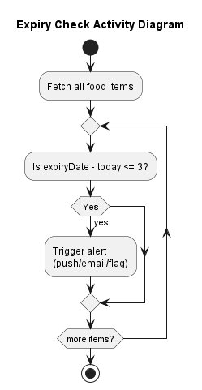

# Design

This chapter explains the strategies used to meet the requirements identified in the analysis. 

Ideally, the design should be the same, regardless of the technological choices made during the implementation phase.

> You can re-order the sections as you prefer, but all the sections must be present in the end

# Architectural Style

## 3-Tier Architecture (Layered Architecture)

### Why this style?

- Clearly separates concerns: UI, business logic, and data persistence
- Promotes maintainability and scalability
- Easy to test and debug due to clear boundaries

---

# Infrastructure

This is a non-distributed system in its initial version.

- **Clients**: Web browsers on mobile, tablets, or desktop
- **Server**: Flask web server running on a single machine (local or hosted)
- **Database**: SQLite file on the same machine as the Flask backend
- **External API**: Gemini (via HTTPS, for recipe suggestions)

---

## Deployment Considerations

- All components can be co-located on a single virtual server or container
- In production:
  - Flask should run behind a web server such as Nginx or Apache
  - DNS can route users to the hosted Flask server (e.g., `wasted.app`)

---

# Modelling

## Domain-Driven Design (DDD)

### Bounded Contexts

- Inventory Management  
- Notification System  
- Waste Statistics  
- Recipe Suggestion Engine

### Domain Concepts

| Context             | Entity / Aggregate       | Description                                      |
|---------------------|--------------------------|--------------------------------------------------|
| Inventory           | `FoodItem`               | Represents a stored food item with all metadata |
| Notification System | `NotificationPreference` | Stores if/when a user wants notifications       |
| Waste Statistics    | `WasteRecord`            | Tracks expired vs consumed items                |
| Recipe Suggestion   | `RecipeQuery / Recipe`   | Models interaction with external AI API         |

### Repositories / Services

- `FoodItemRepository`: Handles CRUD operations  
- `StatisticsService`: Computes waste statistics  
- `NotificationService`: Triggers alert generation  
- `RecipeService`: Communicates with the Gemini API

### Domain Events

- `FoodItemExpired`  
- `FoodItemConsumed`  
- `FoodItemAdded`  
- `PreferencesUpdated`

---

## Context Map

---

# Object-Oriented Modelling

## Main Classes and Attributes

### Class Diagram (UML-style)

---

# Interaction

## Component Communication

### Frontend ↔ Backend (REST API)

| Action               | HTTP Method | Endpoint               | Description                                |
|----------------------|-------------|------------------------|--------------------------------------------|
| Add Food Item        | POST        | `/api/items`           | Adds a new food item                       |
| Get All Items        | GET         | `/api/items`           | Retrieves full inventory                   |
| Get Expiring Items   | GET         | `/api/items/expiring`  | Returns soon-to-expire items               |
| Get Recipe Suggestions | POST      | `/api/recipes`         | Sends ingredients, gets suggestions        |
| Get Waste Statistics | GET         | `/api/statistics`      | Returns food waste data                    |

### Sequence Diagram (Add Item)

---

# Behaviour

## Component Behaviour Overview

### Flask Backend

- **Stateful**: Maintains application logic and interacts with the database
- Updates state when:
  - Food items are added, edited, or deleted
  - Waste statistics are calculated
  - Recipe API is queried

### Frontend

- **Stateless**, except for UI state or session data
- Fetches and displays data via API

### Activity Diagram (Food Expiry Notifications)

---

# Data-Related Aspects

## Persistent Data

### What is stored:

- Food items: name, category, dates, quantity
- Waste records: expired vs consumed
- User preferences

### Where:

- Stored in **SQLite** (local file-based DB)

### Why:

- Ensures persistence across sessions and device restarts

---

## Storage Type

- **Relational Database (SQLite)**  
- Simple schema, structured data, suited for local deployment

### Tables:

- `food_items`
- `waste_stats`
- `user_preferences`

---

## Data Queries

- All database access is handled by the backend:
  - `SELECT` for filters, dashboards, and statistics
  - `INSERT`, `DELETE`, `UPDATE` for food lifecycle management
  - `JOIN` for waste tracking if schema is normalized

---

## Concurrency Considerations

- SQLite + single-threaded Flask = minimal concurrency issues
- For multi-user support: consider Flask + PostgreSQL and multithreading

---

## Data Sharing

- Shared between:
  - Backend and frontend (via API responses)
  - Backend and AI API (for recipe suggestions)
- Not shared among users (single-user system)

