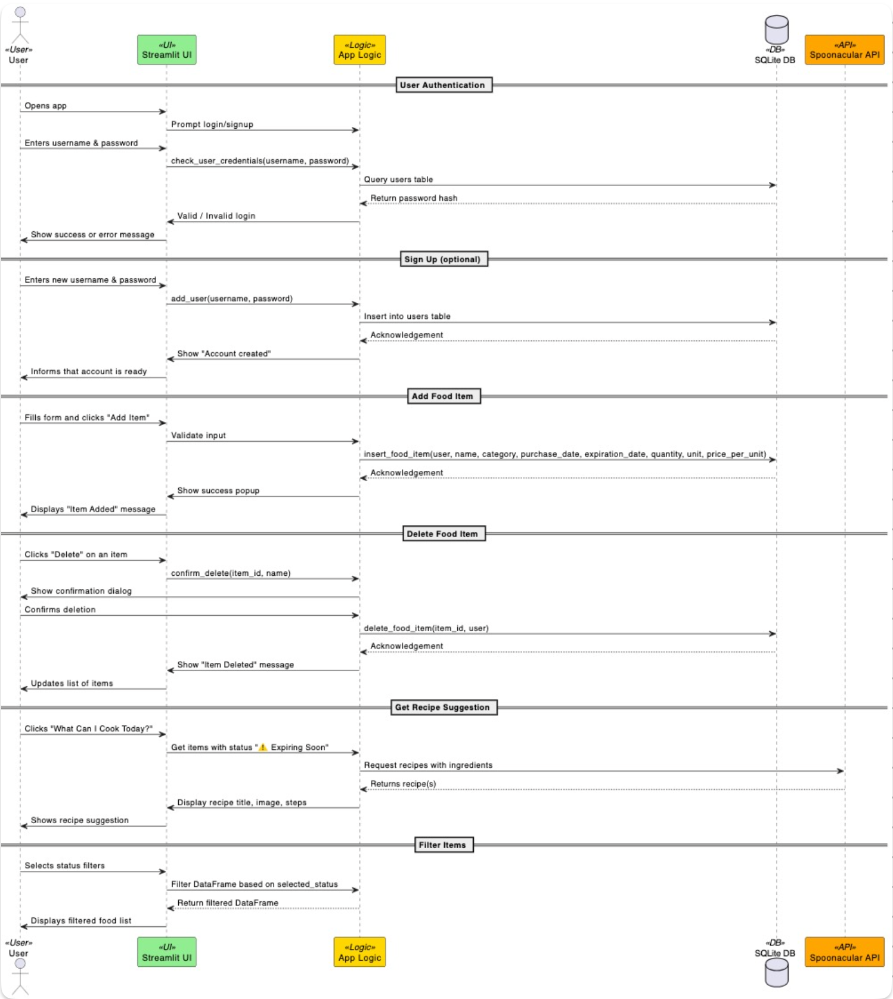

# Design

This chapter explains the strategies used to meet the requirements identified in the analysis.

The design focuses on clear separation of concerns while reflecting the current technological choices (Streamlit frontend + integrated backend).

## Architectural style: 3-Layers architecture 

A **3-Layers architecture** was adopted to separate concerns: UI, business logic, and data persistence.  
This clear division makes the project easier to maintain, scale, and test, with well-defined boundaries that simplify debugging.

---

### 1. Presentation layer (frontend)
- **Technology**: Streamlit (Python-based UI components).  
- **Responsibility**: Provides the user interface for interaction directly within Streamlit.  
- Includes dashboard, login/signup, food item display, filtering, and statistics visualization.  

---

### 2. Application layer (backend)
- **Technology**: Python (integrated with Streamlit).  
- **Responsibility**: Handles business logic such as:  
  - Tracking and updating food items  
  - Expiration date checking  
  - Waste statistics calculation  
  - Recipe suggestion engine via Spoonacular API  

---

### 3. Data layer (persistence)
- **Database**: SQLite (local file).  
- **Responsibility**: Stores food items, expiration dates, price information, and user credentials.  

---

---

## Infrastructure

This is a **non-distributed** system in its initial version.

- **Clients**: Streamlit app accessed via desktop, tablet, or mobile.  
- **Server**: Integrated in Streamlit (local execution or deployed container).  
- **Database**: SQLite file stored locally with the app.  
- **External API**: Spoonacular (via HTTPS, for recipe suggestions).  

---

### Deployment considerations

- All components are co-located in a single app instance.  
- Streamlit handles serving the application without a separate web server.  
- Offline mode is supported via the local SQLite database.  

---

## Modelling

### Domain-Driven Design (DDD)

#### Bounded contexts

- **Inventory management**  
- **Waste statistics**  
- **Recipe suggestion engine**  

---

#### Domain concepts

| Context             | Entity / Aggregate | Description                                                        |
|---------------------|--------------------|--------------------------------------------------------------------|
| Inventory           | `FoodItem`         | Represents a stored food item with metadata (owner, dates, price). |
| Waste Statistics    | `Statistics`       | Tracks expired vs valid items and economic loss.                   |
| Recipe Suggestion   | `RecipeQuery` / `Recipe` | Models interaction with the external recipe API.              |
| User Management     | `User`             | Represents an authenticated user of the system.                    |

---

#### Repositories / Services

- `FoodItemRepository`: Handles CRUD operations in SQLite.  
- `StatisticsService`: Computes waste statistics (expired, valid, loss in €).  
- `RecipeService`: Communicates with Spoonacular API.  
- `UserRepository`: Handles signup/login and credential verification.  

---

#### Domain events

- `FoodItemAdded`  
- `FoodItemExpired`  
- `FoodItemDeleted`  
- `WasteStatisticsUpdated`  

---

### Object-oriented modelling (conceptual)

The class diagram shown here is conceptual and represents the logical organization of the system according to an OOP model.  
The actual code is written in a functional style, using functions and Pandas DataFrames, without formal Python classes.  

#### Main classes and attributes

---

## Interaction

### Component Communication

#### Frontend ↔ Backend integrated in Streamlit

| Action                 | Function / Method Called                           | Description                                                                 |
|------------------------|---------------------------------------------------|-----------------------------------------------------------------------------|
| User signup            | `add_user(username, password)`                     | Creates a new user with hashed password.                                    |
| User login             | `check_user_credentials(username, password)`       | Verifies user credentials and starts a session if valid.                    |
| Add food item          | `insert_food_item(...)`                            | Adds a new food item to the inventory (with price info).                    |
| Get all items          | `get_all_food_items(user)`                         | Retrieves the inventory list for the current user.                          |
| Get expiring items     | `check_status(expiration_date)` + filtering        | Retrieves items that are expiring soon.                                     |
| Delete food item       | `delete_food_item(item_id, user)`                  | Deletes a food item by its ID.                                              |
| Get recipe suggestions | `"What Can I Cook Today?"` button (Spoonacular API)| Suggests recipes using soon-to-expire ingredients.                          |
| Get waste statistics   | `calculate_statistics(df)`                         | Computes statistics (total, expired, valid, and lost €).                    |

---

#### Sequence diagram (Add item)

---

## Behaviour

### Component behaviour overview

#### Backend

- **Stateful**: Maintains application logic and interacts with the database  
- Updates state when:
  - Food items are added, edited, or deleted  
  - Waste statistics are calculated  
  - Recipe API is queried  

#### Frontend

- **Stateless**, except for UI state or session data  
- Fetches and displays data via API  

---

## Data-related aspects

### Persistent data

#### What is stored
- Food items: name, category, purchase date, expiration date, quantity, unit, price per unit.  
- User accounts: username, password hash.  
- Derived statistics (calculated at runtime, not persisted).

#### Where
- Stored in **SQLite** (local file-based DB)

#### Why
- Ensures persistence across sessions and device restarts

---

### Storage type

- **Relational Database (SQLite)**  
- Simple schema, structured data, suited for local deployment

#### Tables

- `food_items`  
- `users`  

---

### Data queries

- All database access is handled internally via Python/SQLite:  
  - `CREATE` for adding tables  
  - `INSERT` for new records  
  - `SELECT` for queries and dashboards  
  - `DELETE` for removing items  
  - `JOIN` (optional) for multi-table queries if schema evolves  

---

## Concurrency considerations

- Single-user Streamlit app + SQLite → minimal concurrency issues  

---

### Data sharing

- Shared between:  
  - Backend and frontend (via API responses)  
  - Backend and AI API (for recipe suggestions)  
- Not shared among users (single-user system)  
