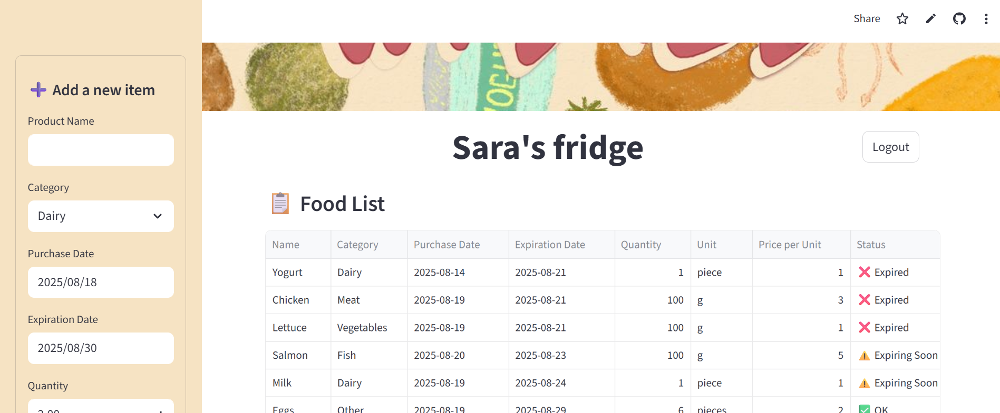
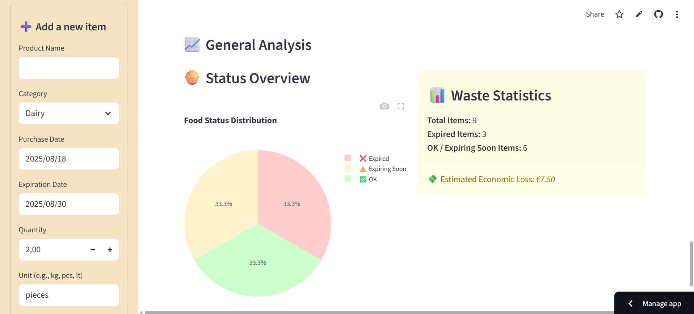

# User guide

# Launching the application
To run the web application, execute the following command:

```bash
streamlit run app.py
```
This will start the Streamlit server and automatically open the application in the browser.

# Deployed version

The application has also been deployed using Streamlit Cloud, so it can be accessed directly via a web link without running it locally.
Users can simply open the link in any browser to use the app.
[https://wastedapp.streamlit.app//](https://wastedapp.streamlit.app//)

# Login
When opening the application, the user is first presented with the **Sign Up / Login page**.


- **Sign Up:**  
  A new user must create an account by choosing a username and password.  
 
- **Login:**  
  Once registered, the user can log in with the chosen username and password. 


# User interface and features

When the application loads, the user is presented with a sidebar menu that serves as the main input panel. From here, the user can:
- Enter the food name (e.g., "Milk", "Carrots", "Chicken breast")
- Select the category of the item (fruit, meat, vegetables, dairy products, etc.)
- Provide the purchase date and expiry date, ensuring accurate tracking of freshness
- Indicate the quantity together with the correct unit of measure (e.g., grams, liters, pieces)
- Provide the price for buying that item

All added food items are automatically displayed in a persistent list on the home page. This list is continuously updated and sorted into three main status:
- ✅ OK – items still fresh and safe to consume
- ⏳ Expiring soon – items close to their expiry date, highlighted to encourage timely consumption
- ❌ Expired – items that have already passed their expiry date

The sidebar also includes a filtering function that allows users to quickly view only the foods that match their expiry status of interest (e.g., show only “expiring soon” items).


# Smart cooking suggestions
Further down the sidebar, users will find the “What can I cook today?” button.
This feature is integrated with the Spoonacular API and automatically generates recipe suggestions based on the items in the fridge, prioritizing foods that are near expiration.
This not only helps reduce waste but also provides inspiration for meal planning directly within the application.


# Data visualization and insights
At the bottom of the interface, the application presents a set of statistics and visual insights, which include:
- The number of items currently fresh, expiring soon, or already expired
- The percentage of food waste relative to the total
- An estimate of the economic loss caused by expired products that were not consumed in time

These insights are designed to make users more aware of their consumption habits, helping them improve planning, reduce unnecessary purchases, and ultimately save money while reducing food waste.
